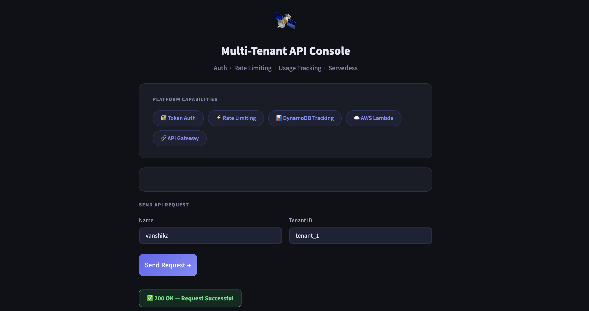
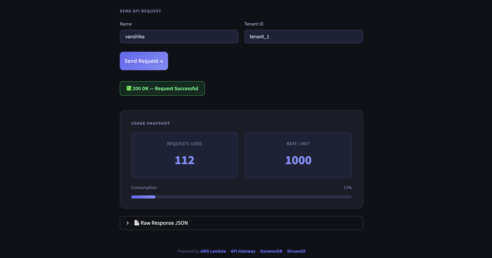
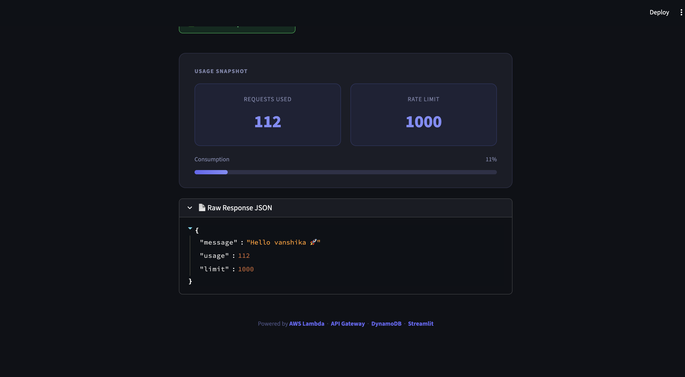

🛰️ Serverless Multi-Tenant REST API
A production-ready serverless backend built on AWS that supports multi-tenant authentication, dynamic rate limiting, and real-time usage tracking — paired with an interactive Streamlit dashboard for monitoring and testing.

📌 Overview
This project implements a fully serverless REST API architecture where multiple tenants can interact with a shared backend while remaining logically isolated. Each tenant has its own configuration, request quota, and usage counter managed in DynamoDB. Requests are authenticated via bearer tokens and rate-limited dynamically — all without managing any servers.

✨ Features

🔐 Token-based Authentication — Bearer token validation on every request via HTTP Authorization headers
🏢 Multi-Tenant Architecture — Isolated per-tenant configurations stored and managed in DynamoDB
⚡ Dynamic Rate Limiting — Atomic counters and conditional writes enforce per-tenant request quotas in real time
📊 Usage Tracking — Live request counting per tenant to support quota-based access control
🖥️ Streamlit Dashboard — Interactive frontend for API testing, response visualization, and usage monitoring
☁️ Fully Serverless — Auto-scaling, pay-per-use, zero infrastructure management

🏗️ Architecture
Client (Streamlit)
      │
      ▼
Amazon API Gateway
      │
      ▼
AWS Lambda (Node.js)
      │
      ├── Authenticate token
      ├── Fetch tenant config
      ├── Check & increment usage counter
      └── Return response / enforce rate limit
            │
            ▼
      Amazon DynamoDB
      (tenant configs + usage tracking)

🧰 Tech Stack
LayerTechnologyCloudAWS (Lambda, API Gateway, DynamoDB)BackendNode.js (AWS SDK v3)FrontendStreamlit (Python)ArchitectureServerless, Multi-tenant

🚀 Getting Started
Prerequisites

AWS account with Lambda, API Gateway, and DynamoDB access
Node.js 18+
Python 3.9+
Streamlit (pip install streamlit)

1. Clone the repository
bashgit clone https://github.com/your-username/serverless-multi-tenant-api.git
cd serverless-multi-tenant-api
2. Deploy the Lambda function
bashcd backend
npm install
# Zip and deploy to AWS Lambda via Console or AWS CLI
3. Set up DynamoDB
Create a table with the following schema:

Table name: tenants
Partition key: tenantId (String)

Seed a tenant record:
json{
  "tenantId": "tenant_1",
  "limit": 10,
  "usage": 0,
  "token": "my-secret-token"
}
4. Configure API Gateway

Create a REST API with a GET /hello route
Point it to your Lambda function
Enable CORS and deploy the stage

5. Run the Streamlit frontend
bashcd frontend
pip install -r requirements.txt
streamlit run app.py

## Screenshots

### Successful API Request

---

### Rate Limit Exceeded

---

### JSON Response

📂 Project Structure
serverless-multi-tenant-api/
├── backend/
│   ├── index.js          # Lambda handler
│   └── package.json
├── frontend/
│   ├── app.py            # Streamlit dashboard
│   └── requirements.txt
├── screenshots/
└── README.md

🔮 Future Improvements

JWT-based authentication for enhanced security
Admin dashboard for tenant management
CI/CD pipeline via GitHub Actions
CloudWatch integration for logging and alerting

👩‍💻 Author
Vanshika
GitHub · LinkedIn

📄 License
This project is licensed under the MIT License